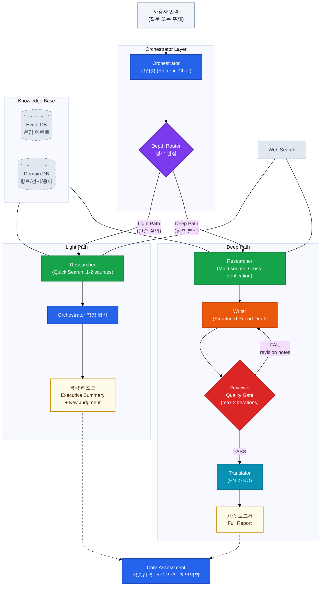

# 류준영 — AI/Data Engineer

> I find what others miss in AI — then build it or fix it.

📧 joseph.jy.ryu@gmail.com · 📍 Seoul, South Korea
🔗 [LinkedIn](https://linkedin.com/in/junyoung-ryu-422501117) · 💻 [GitHub](https://github.com/jun0-ds)

---

## 의료 AI 경험

### 의료 텍스트 분석 — 병원 판독소견서는 비정형 텍스트라 구조화가 안 된다

> 미소정보기술 | AI 엔지니어 | 2019 – 2020

`Python` `NLP` `의료 데이터` `챗봇`

- 영상의학과 리포트 등 비정형 텍스트 전처리 파이프라인 적용 (TA 엔진은 회사 자체 엔진 사용)
- 의료 도메인 데이터 특성(비정형, 약어, 혼용 표기)에 대한 실무 이해
- 당시에는 규칙 기반 전처리 + 키워드 추출 방식이었으나, 현재는 LLM/임베딩 기반으로 근본적으로 접근이 달라짐

### KISTI 챗봇 — 연구자료 검색을 대화형으로 할 수 없을까

- 한국과학기술정보연구원(KISTI) 대전 센터용 대화형 챗봇 API 개발
- 챗봇 내부 가비지 필터링 파트를 LM/AI로 개발

---

## Larchive — 해운물류 AI 스타트업

해운물류 AI 스타트업 [Larchive](https://larchive.simplogis.com)에서 AI 모델·LLM 에이전트·데이터 파이프라인을 중심으로 서비스를 설계·개발해 왔으며, 프론트엔드·인프라 영역도 서비스 개발 과정에서 실무 경험을 쌓았습니다.

> 각 항목을 **클릭하면 상세 내용과 스크린샷**을 볼 수 있습니다.

### 항만 모니터링 — 전 세계 항만 상황을 실시간으로 파악할 방법이 없다

수작업으로는 전 세계 항만의 혼잡·지연을 커버할 수 없다 → 자동 수집 + 실시간 대시보드로 해결. 🟢 운영 중

상세 보기

> Larchive (심플로지스)

`React 19` `FastAPI` `Mapbox GL` `Docker` `네이버 클라우드(NCP)`

**2025 – 현재**

- 전 세계 선박 실시간 위치 추적 + 항만 혼잡도 모니터링 대시보드
- 혼잡도(port congestion), RT 혼잡(port units), 해역 뷰 + 세부항만 상세 분석 (Port Calls, 주간 혼잡도 리포트)
- 13개 주요 초크포인트(수에즈, 말라카 등) 30분 주기 자동 수집, 20개 항만 혼잡도 스냅샷
- 이상 탐지(좌초, AIS 불일치 등) 자동 알림 시스템
- Marinesia API 연동, 요금 최적화
- GCP·NCP 기반 프로덕션/개발 서버 이중 배포, Docker Compose 기반 인프라
- 기업 고객(삼성전자 DA, 현대글로비스 캐나다 등) 대상 항만 지연 예측 모델 납품

  

### AI 에이전트 챗봇 — 데이터가 있어도 비개발자가 직접 조회할 수 없다

자연어로 물어보면 데이터를 찾아서 답해주는 AI 에이전트. 🟢 운영 중

상세 보기

> Larchive (심플로지스)

`GPT-4` `Gemini` `LangChain` `Redis` `Slack Bot`

**2025 – 현재**

- 사내 AI 에이전트: 선박·항만·운임 데이터를 자연어로 질의
- 웹 대시보드 내 채팅 패널 + Slack 채널 통합 운영
- 격리된 Docker 샌드박스 내 코드 실행 기능
- 행동 구조화(sonmat) + 멀티디바이스 메모리(bobusang) 기술 적용

  

### 운임시황 모니터링 — 해운 운임 예측이 어렵고, 뉴스를 사람이 읽고 판단하는 데 시간이 든다

ML 모델로 시황을 자동 분류하고, LLM 에이전트가 브리핑·예측·시나리오 분석까지 자동 생성. 🟢 운영 중

상세 보기

> Larchive (심플로지스)

`SetFit` `LLM Agent` `Python` `NLP` `통계 모델링` `SCFI` `LCI`

**2023 – 현재**

- 뉴스·시황 리포트를 해운 시장 상황으로 자동 분류하는 ML 모델
- SetFit(Few-shot Sentence Transformer) 기반, 소량 데이터로 고성능 달성
- LLM 에이전트 기반 브리핑 자동 생성 + 시나리오 분석
- 브리핑 → 예측분석(해상/항공) → 시나리오분석 → 이슈분석까지 다층 분석 서비스
- SCFI(상하이 종합운임지수), LCI 등 주요 해운 지수 예측 모델 개발
- 통계+DL 하이브리드 접근, 95% 신뢰구간 월간 예측
- 7개 글로벌 운임 지수(FBX, XSI, KCCI 등) 추세 분석 시스템
- 성균관대 협력 연구: SHAP 기반 모델 해석성 논문 공저

  

### 공급망 리스크 모니터링 — 리스크가 터지면 이미 늦다, 사전 감지가 필요하다

뉴스 기반 공급망 리스크 조기 경보 시스템. TIPS 정부 연구과제 선정. 🟢 운영 중

상세 보기

> Larchive (심플로지스)

`Neo4j` `NER` `이상 탐지` `TIPS 연구과제`

**2023 – 현재**

- 뉴스 기반 공급망 리스크 조기 경보 시스템 (TIPS 정부 연구과제 선정)
- 개체명 인식(NER)으로 리스크 행위자 추출 → Neo4j 그래프 분석 → 심각도 스코어링
- 이슈 분류·감성 분석 → 위험 전파 모델링
- 이슈추적: 카테고리별 리스크 버블 시각화 + 템플릿 기반 추적

  

### 리포팅 에이전트 — 정기 리포트를 사람이 매번 쓰는 건 비효율이다

데이터 수집부터 분석·리포트 발행까지 전 과정을 LLM 에이전트가 자동화. 🟢 운영 중

상세 보기

> Larchive (심플로지스)

`GPT/Claude 연동` `Python` `자동화`

**2025 – 현재**

- 운임 시황, 관세·공급망 뉴스를 수집 → LLM 에이전트 기반 자동 리포트 생성
- 정기 리포트 자동 발행 + Slack 배포
- 데이터 수집 → 정제 → 분석 → 리포트 전 과정 자동화

  

---

## 기타 경험

<b>데이터마케팅코리아</b> — ML/통계 분석가 · 인턴 | 2017 – 2018

`Python` `NLP` `Active Learning` `tf-idf` `TextRank`

- 서울시 공공자전거 이용 예측 및 패턴 클러스터링
- 소셜미디어 키워드 추출·분석 (tf-idf, TextRank)
- Active Learning 기반 효율적 데이터 라벨링 및 모델 학습
- 공공 데이터 분석 및 마케팅 인텔리전스

<b>이마트 데이터 분석</b> — EDA·그래프 모델링 | 2021

> KAIST [DSAIL](https://dsail.kaist.ac.kr/) (박찬영 교수 연구실) · 신세계아이앤씨 산학협력

`Python` `Jupyter` `Pandas` `GNN` `Taxonomy Construction`

- 이마트24 상품 마스터(49,299개) + 거래 데이터(845,626건) 탐색적 분석
- 3단계 상품 분류 체계(대/중/소분류) 기반 카테고리별·기간별·아이템별 다각적 EDA
- 그래프 기반 택소노미 구축 연구 (TaxoExpan, STEAM, CoRel 등 GNN 기법 적용)
- 신세계아이앤씨-KAIST AI연구센터 산학과제로 수행

<b>수능 등급컷 예측 · 비문학 지문 개발</b> — 모델 개발·기술 지문 집필 | 2023 – 현재

`Python` `통계 모델링` `교육`

- 과거 수능 데이터 기반 1등급컷 시뮬레이션 예측 모델 (공개 데모 배포)
- 강남대성학원 수능 독서(비문학) 기술 지문 집필 — 데이터가 있으면 교육 도메인도 커버 가능

<b>메신저봇 플랫폼</b> — 아키텍처 설계·봇 개발 | 2026

`Python 3.12` `FastAPI` `discord.py`

- 디스코드 멀티게임 봇 플랫폼 — 사내 메신저 봇이나 업무 에이전트로 응용 가능
- Oracle Cloud 기반 24/7 봇 인프라 운영 경험

---

## Technical Skills

| 영역 | 스택 |
|------|------|
| **Languages** | Python, TypeScript, Rust, SQL |
| **AI/ML** | PyTorch, SetFit, OpenAI/Claude/Gemini API, LangChain, SHAP, NLP, Forecasting |
| **Backend** | FastAPI, SQLAlchemy, Firebase Auth, Redis, Neo4j, Milvus |
| **Frontend** | React 19, Vite, Mapbox GL, Tailwind CSS |
| **Data** | Pandas, Selenium, PowerBI, Jupyter |
| **Infra** | Docker, GCP, 네이버 클라우드(NCP), Oracle Cloud, systemd, GitHub Actions |
