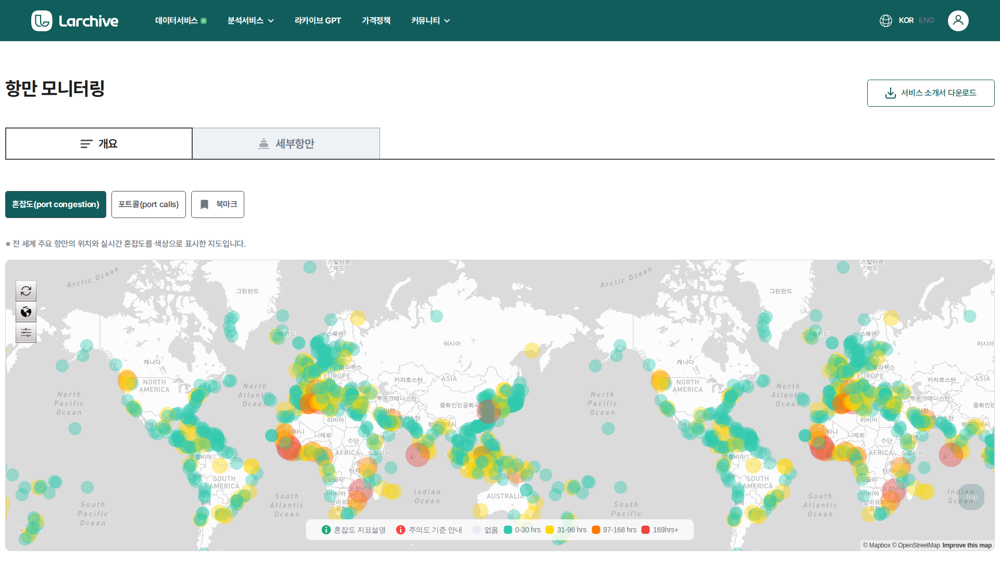
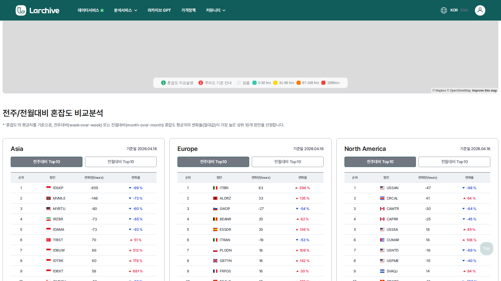
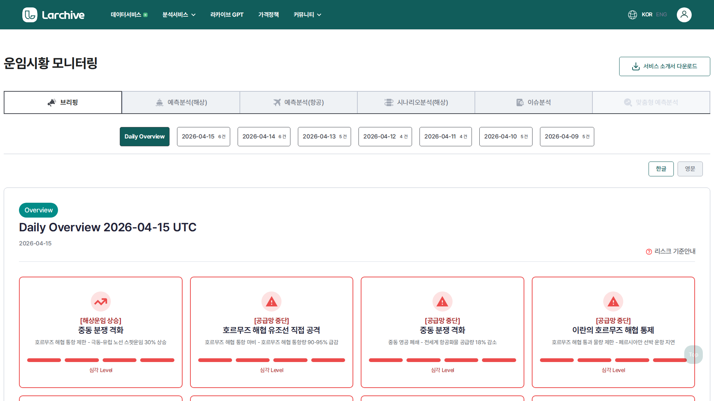
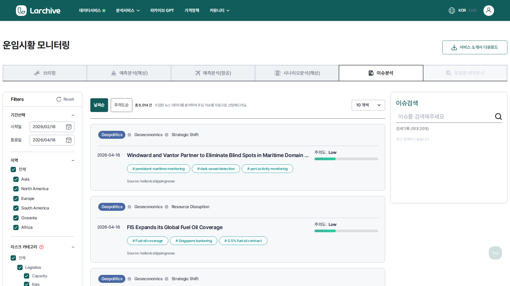
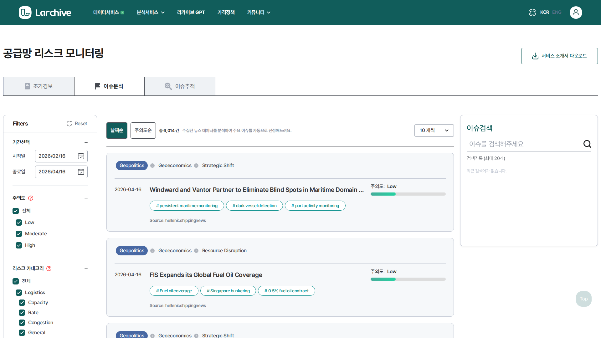
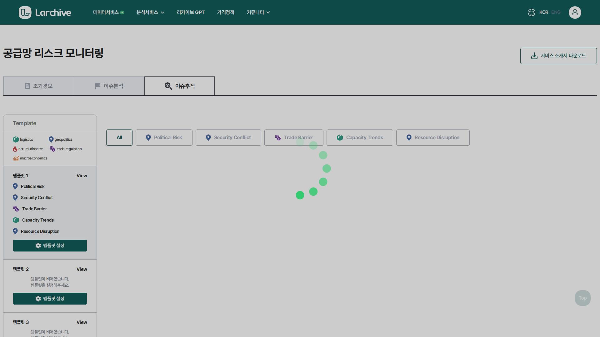

# 류준영 — AI/Data Engineer

> I find what others miss in AI — then build it or fix it.

📧 joseph.jy.ryu@gmail.com · 📍 Seoul, South Korea
🔗 [LinkedIn](https://linkedin.com/in/junyoung-ryu-422501117) · 💻 [GitHub](https://github.com/jun0-ds)

---

## Technical Skills

| 영역 | 스택 |
|------|------|
| **Languages** | Python, TypeScript, Rust, SQL |
| **AI/ML** | PyTorch, SetFit, OpenAI/Claude/Gemini API, LangChain, SHAP, TTS/Vision AI |
| **Backend** | FastAPI, SQLAlchemy, Firebase Auth, Redis, Neo4j, Milvus |
| **Frontend** | React 19, Vite, Mapbox GL, Tailwind CSS |
| **Data** | Pandas, Selenium, PowerBI, Jupyter |
| **Infra** | Docker, NCP, Oracle Cloud, systemd, GitHub Actions |

---

## Larchive — 해운물류 AI 스타트업

해운물류 AI 스타트업 Larchive에서 데이터 수집부터 ML 모델, 대시보드, 챗봇까지 서비스 전체를 설계·개발·운영해 왔습니다.

### 항만 모니터링 대시보드

`React 19` `FastAPI` `Mapbox GL` `Docker` `NCP`

**풀스택 설계·개발·배포·운영** | 2025 – 현재

- 전 세계 선박 실시간 위치 추적 + 항만 혼잡도 모니터링 대시보드
- 13개 주요 초크포인트(수에즈, 말라카 등) 30분 주기 자동 수집, 20개 항만 혼잡도 스냅샷
- 이상 탐지(좌초, AIS 불일치 등) 자동 알림 시스템
- Marinesia API 연동, 요금 최적화(시간당 90콜, 30% 사용률 유지)
- NCP 프로덕션/개발 서버 이중 배포, Docker Compose 기반 인프라

  

  

---

### AI 에이전트 챗봇

`GPT-4` `Gemini` `LangChain` `Redis` `Slack Bot`

**설계·개발·Slack 연동** | 2025 – 현재

- 사내 AI 에이전트: 선박·항만·운임 데이터를 자연어로 질의
- 웹 대시보드 내 채팅 패널 + Slack 채널 통합 운영
- 격리된 Docker 샌드박스 내 코드 실행 기능
- 행동 구조화(sonmat) + 멀티디바이스 메모리(bobusang) 기술 적용

---

### 운임시황 모니터링

`SetFit` `Python` `NLP` `프로덕션 배포`

**모델 설계·학습·배포** | 2024 – 현재

- 뉴스·시황 리포트를 해운 시장 상황으로 자동 분류하는 ML 모델
- SetFit(Few-shot Sentence Transformer) 기반, 소량 데이터로 고성능 달성
- 브리핑 → 예측분석 → 시나리오분석 → 이슈분석까지 다층 분석 서비스
- NCP 프로덕션 서버에서 실시간 서비스 운영 중

  

  

---

### 공급망 리스크 모니터링

`Neo4j` `NER` `이상 탐지` `TIPS 연구과제`

**NER 파이프라인·네트워크 분석 설계** | 2023 – 현재

- 뉴스 기반 공급망 리스크 조기 경보 시스템 (TIPS 정부 연구과제 선정)
- 개체명 인식(NER)으로 리스크 행위자 추출 → Neo4j 그래프 분석 → 심각도 스코어링
- 이슈 분류·감성 분석 → 위험 전파 모델링
- 이슈추적: 카테고리별 리스크 버블 시각화 + 템플릿 기반 추적

  

  

---

### 컨테이너 운임 예측 모델

`통계 모델링` `시계열 분석` `SCFI` `LCI`

**모델 설계·검증** | 2023 – 현재

- SCFI(상하이 종합운임지수), LCI 등 주요 해운 지수 예측 모델 개발
- 통계+ML 하이브리드 접근, 95% 신뢰구간 월간 예측
- 7개 글로벌 운임 지수(FBX, XSI, KCCI 등) 추세 분석 시스템
- 성균관대 협력 연구: SHAP 기반 모델 해석성 논문 공저

---

### 항만 지연 예측 — 삼성전자

`ML` `AIS 데이터` `예측 모델`

**모델 개발·납품** | 2024

- 삼성전자 차량 운송(RO-RO) 일정 최적화를 위한 항만 지연일수 예측
- AIS 데이터 + 항만 혼잡도 기반 5~7일 선행 예측
- 기업 고객 대상 커스텀 분석 납품

---

### 자동 리포트 생성 시스템

`GPT/Claude 연동` `Python` `자동화`

**파이프라인 설계·개발** | 2025 – 현재

- 운임 시황, 관세·공급망 뉴스를 수집 → LLM 연동 자동 리포트 생성
- 정기 리포트 자동 발행 + Slack 배포
- 데이터 수집 → 정제 → 분석 → 리포트 전 과정 자동화

---

## 기타 경험

### 의료 텍스트 분석 — SmartTA

`Python` `NLP` `의료 데이터`

**전처리 모듈 개발, TA 파이프라인 설계** | 2019 – 2020

- 병원 판독소견서(영상의학과 리포트 등) 비정형 텍스트에서 가비지 제거·정규화 파이프라인 구축
- 당시에는 규칙 기반 전처리 + 키워드 추출 방식이었으나, 현재는 LLM/임베딩 기반으로 근본적으로 접근이 달라짐
- KISTI(한국과학기술정보연구원) 챗봇 API 개발 경험도 보유
- 의료 도메인 데이터 특성(비정형, 약어, 혼용 표기)에 대한 실무 이해

---

### 수능 등급컷 예측 · 비문학 지문 개발

`Python` `통계 모델링` `교육`

**모델 개발 · 기술 지문 집필** | 2023 – 현재

- 과거 수능 데이터 기반 1등급컷 시뮬레이션 예측 모델 (공개 데모 배포)
- 강남대성학원 수능 독서(비문학) 기술 지문 집필 — 데이터가 있으면 교육 도메인도 커버 가능

---

### 이마트24 · 메신저봇 외

`Jupyter` `discord.py` `FastAPI`

**데이터 분석 · 봇 개발** | 2021 – 2026

- 이마트24 편의점 운영 데이터 EDA 및 시각화
- 디스코드 멀티게임 봇 플랫폼 — 사내 메신저 봇이나 업무 에이전트로 응용 가능
- Oracle Cloud 기반 24/7 봇 인프라 운영 경험
