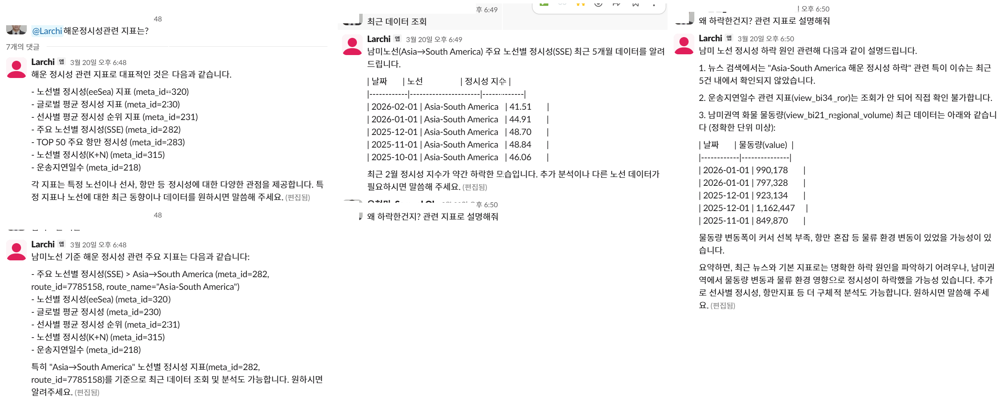
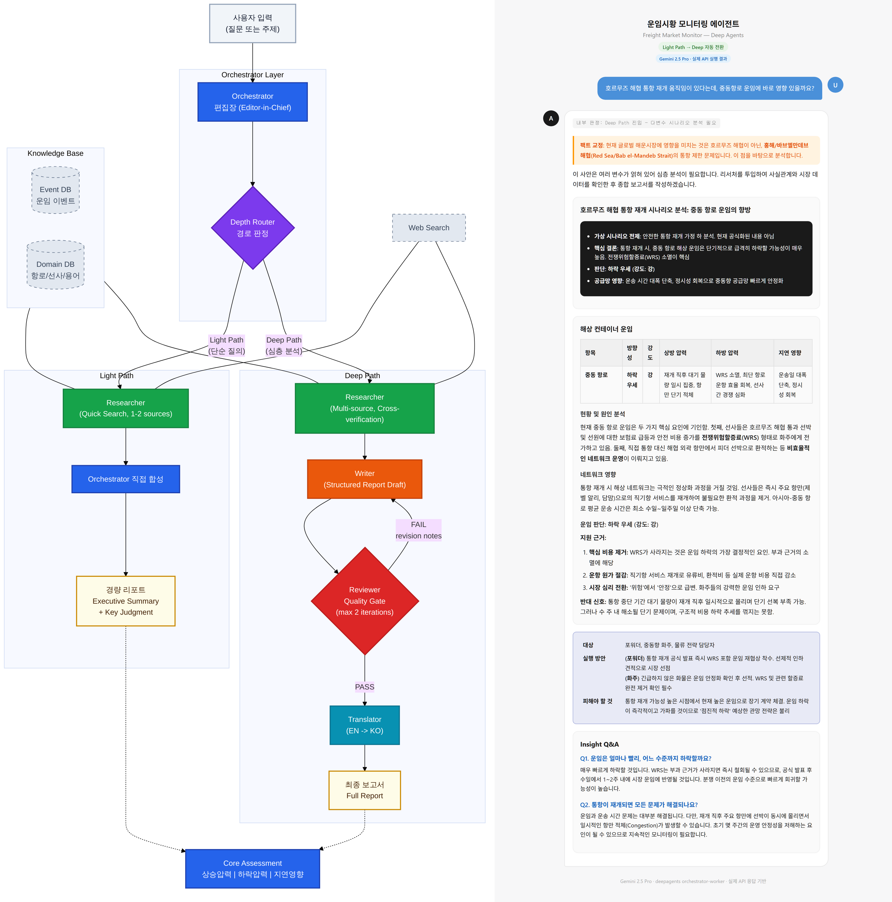
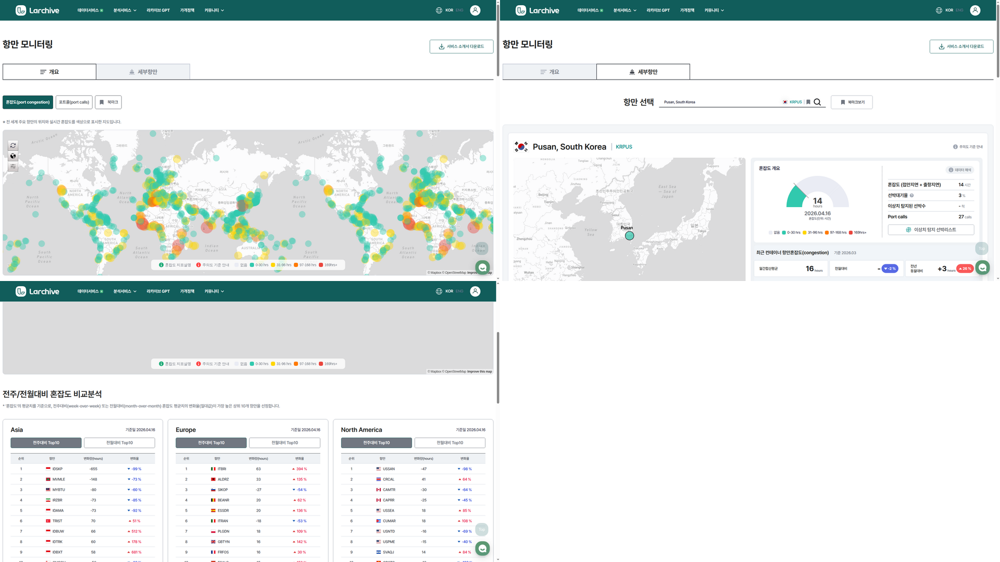
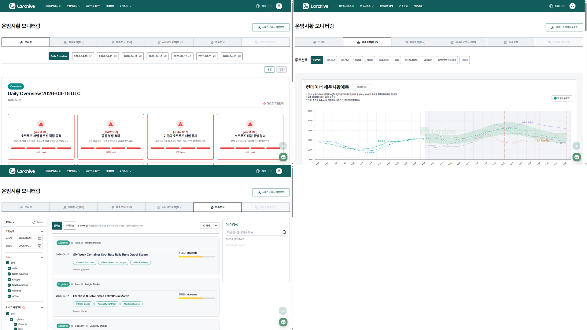
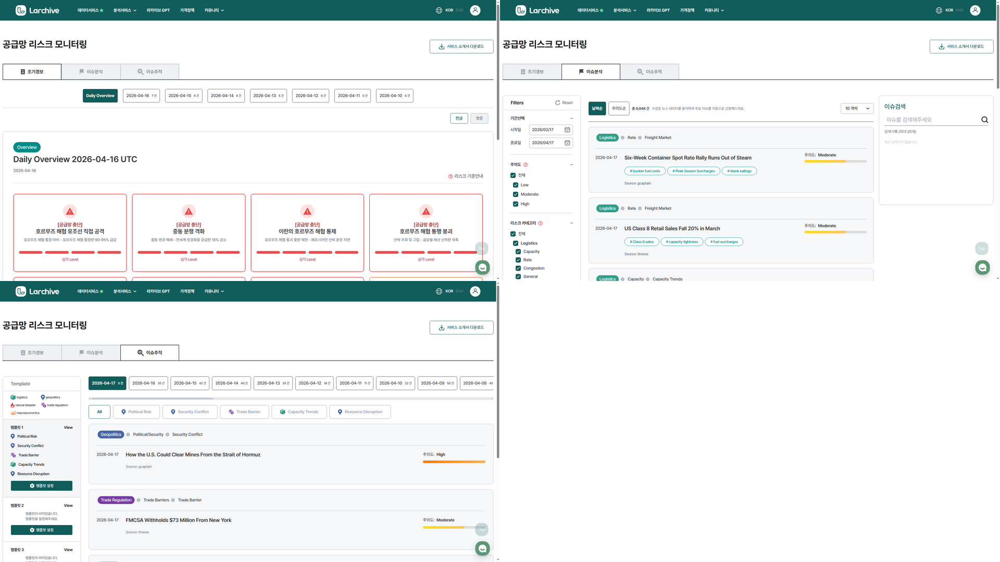

# 류준영 — AI/Data Engineer

📧 joseph.jy.ryu@gmail.com · 📍 Seoul, South Korea
🔗 [LinkedIn](https://linkedin.com/in/junyoung-ryu-422501117) · 💻 [GitHub](https://github.com/jun0-ds)

데이터를 모아 구조화하고, 반복되는 판단을 AI로 자동화합니다.

해운물류에서 의사결정 소요시간을 300시간에서 30분으로 줄이는 시스템을 만들었고,

의료·교육·유통 데이터에도 같은 접근을 적용해 왔습니다.

---

## 의료 텍스트 AI — 병원 판독소견서를 구조화된 데이터로

> 미소정보기술 | AI 엔지니어 | 2019 – 2020

**문제**: 병원 판독소견서(영상의학과 리포트 등)는 비정형 텍스트라 검색·분류·통계가 불가능하다.

**해결**: 의료 도메인 특화 텍스트 전처리 파이프라인을 구축하여, 비정형 판독소견서를 구조화된 데이터로 변환. 약어·혼용 표기 등 의료 텍스트 특유의 노이즈를 처리하는 실무 경험.

**KISTI 연구자료 검색 챗봇**: 한국과학기술정보연구원(KISTI) 대전 센터에 대화형 연구자료 검색 챗봇 API 납품. 챗봇 내부 가비지 필터링을 LM/AI로 개발.

---

## Larchive — 해운물류 AI 스타트업

해운물류 AI 스타트업 [Larchive](https://larchive.simplogis.com)에서 AI 모델·LLM 에이전트·데이터 파이프라인을 중심으로 서비스를 설계·개발해 왔으며, 프론트엔드·인프라 영역도 서비스 개발 과정에서 실무 경험을 쌓았습니다.

### AI 에이전트 챗봇 — 데이터가 있어도 비개발자가 직접 조회할 수 없다

**문제**: 데이터베이스에 정보가 있어도 비개발자는 직접 조회할 수 없다. 매번 개발자에게 요청해야 하는 병목.

**해결**: 자연어로 물어보면 데이터를 찾아서 답해주는 사내 AI 에이전트. 웹 대시보드 + Slack 채널 통합 운영. 격리된 Docker 샌드박스 내 코드 실행.

**결과**: 비개발자가 직접 데이터 질의 가능. 🟢 운영 중

  

### 리포팅 에이전트 — 정기 리포트를 사람이 매번 쓰는 건 비효율이다

**문제**: 운임 시황·관세·공급망 뉴스를 종합한 정기 리포트를 분석가가 매번 수작업으로 작성.

**해결**: 데이터 수집 → 정제 → 분석 → 리포트 발행까지 전 과정을 LLM 에이전트가 자동화. Orchestrator가 질문 난이도를 판별하여 Light/Deep Path로 분기.

**결과**: 리포트 작성 완전 자동화, Slack 정기 배포. 🟢 운영 중

  

### 항만 모니터링 — 전 세계 항만 혼잡을 실시간으로 파악할 방법이 없다

**문제**: 해운사·화주는 전 세계 항만의 혼잡·지연 상황을 파악하기 위해 수작업으로 여러 소스를 확인해야 했다. 항만이 수백 개인 상황에서 수동 모니터링은 불가능.

**해결**: 700개 항만 혼잡도를 자동 수집하고, 70,000척 선박을 실시간 추적하는 모니터링 대시보드를 구축. 13개 주요 초크포인트(수에즈, 말라카 등) 30분 주기 수집, 이상 탐지(좌초, AIS 불일치) 자동 알림.

**결과**: 삼성전자 DA, 현대글로비스 캐나다 등 기업 고객에 항만 지연 예측 모델 납품. 🟢 운영 중

  

### 운임 예측 — 시황 판단에 사람이 너무 많은 시간을 쓴다

**문제**: 해운 운임 예측은 뉴스·지표·시장 상황을 종합해야 하는데, 분석가가 수작업으로 읽고 판단하는 데 평균 300시간 이상 소요. 정기 리포트 작성도 매번 반복.

**해결**: ML 모델(SetFit)로 뉴스·시황을 자동 분류하고, LLM 에이전트가 브리핑·예측·시나리오 분석·리포트까지 자동 생성하는 파이프라인 구축. 매일 2,000건 글로벌 공급망 이슈를 자동 수집·분석.

**결과**: 의사결정 소요시간 300시간 → 30분 이내. SCFI 등 주요 운임 지수 95% 신뢰구간 월간 예측. 성균관대 협력 SHAP 기반 모델 해석성 논문 주저자. 🟢 운영 중

  

### 공급망 리스크 조기 경보 — 리스크가 터지면 이미 늦다

**문제**: 전쟁·파업·자연재해 등 공급망 리스크는 터진 뒤에야 파악된다. 사전 감지가 안 되면 대응이 늦고, 재정적 손실로 이어진다.

**해결**: 900개 이상 소스에서 뉴스를 자동 수집, NER로 리스크 행위자를 추출하고 Neo4j 그래프 분석으로 심각도를 스코어링하는 조기 경보 시스템 구축.

**결과**: TIPS 정부 연구과제 선정. 국내 특허 3건. 🟢 운영 중

  

---

## 기타 경험

<b>데이터마케팅코리아</b> — ML/통계 분석가 (인턴 → 정규직) | 2017 – 2018

- 서울시민안전 빅데이터 AI 프로젝트 — 전세사기·짝퉁·다단계 등 분류를 위한 LM 모델 데이터 태깅 및 학습
- 서울시 공공자전거 이용 예측 및 패턴 클러스터링
- 소셜미디어 키워드 추출·분석 (tf-idf, TextRank)
- Active Learning 기반 효율적 데이터 라벨링 및 모델 학습

<b>이마트 데이터 분석</b> — KAIST DSAIL · 신세계아이앤씨 산학협력 | 2021

- 이마트24 상품 마스터(49,299개) + 거래 데이터(845,626건) 탐색적 분석
- 그래프 기반 택소노미 구축 연구 (TaxoExpan, STEAM, CoRel 등 GNN 기법 적용)

<b>수능 등급컷 예측 · 비문학 지문 개발</b> | 2023 – 현재

- 과거 수능 데이터 기반 1등급컷 시뮬레이션 예측 모델 (공개 데모 배포)
- 강남대성학원 수능 독서(비문학) 기술 지문 집필

<b>메신저봇 플랫폼</b> — 아키텍처 설계·봇 개발 | 2026

- 디스코드 멀티게임 봇 플랫폼 — 사내 메신저 봇이나 업무 에이전트로 응용 가능
- Oracle Cloud 기반 24/7 봇 인프라 운영 경험

---

## Technical Skills

| 영역 | 스택 |
|------|------|
| **Languages** | Python, TypeScript, Rust, SQL |
| **AI/ML** | PyTorch, SetFit, OpenAI/Claude/Gemini API, LangChain, SHAP, NLP, Forecasting |
| **Backend** | FastAPI, SQLAlchemy, Firebase Auth, Redis, Neo4j, Milvus |
| **Frontend** | React 19, Vite, Mapbox GL, Tailwind CSS |
| **Data** | Pandas, Selenium, PowerBI, Jupyter |
| **Infra** | Docker, GCP, 네이버 클라우드(NCP), Oracle Cloud, systemd, GitHub Actions |
